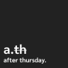

after.thursday.

Personally, Thursday is one of the most important checkpoint in tired a week.  It's a day where i can take a look at my self, clear the thoughts in my heads,  and thinking of important lessons i faced. It's like a pressing a restart button and moving on to face a wonderful life waiting aheads next week

yo.
___

วันพฤหัสบดีสำหรับเรา เป็นเหมือน checkpoint สำคัญ ในหนึ่งสัปดาห์สำหรับเรา เพราะ เป็นวันที่เราได้เรียบเรียงความคิด สรุปสิ่งที่เกิดขึ้นในสัปดาห์ และทบทวนและเรียนรู้สิ่งสำคัญที่ได้เจอในชีวิต “after thursday” เป็นคำที่เหมือนเราได้ใช้เตือนตัวเองว่า เราจะได้เรียนรู้ และพบเจอสิ่งใหม่ๆในชีวิต เปรียบได้กับการเริ่มต้นใหม่ การเตือนตัวเองให้พร้อมที่จะมองไปข้างหน้าและพร้อมที่จะเรียนรู้ไปกับทุกๆวันของสัปดาห์ต่อๆไป

การที่เราเลือกที่จะใช้คำนี้แทนตัวเราสำหรับ Portfolio นี้ก็เพื่อเป็นการย้ำเตือนตัวเองให้พร้อมที่จะเดินไปข้างหน้า และพบเจอสิ่งๆใหม่ๆ และ challenge ต่างๆที่จะได้พบเจอในชีวิต โดยที่ยังจดจำสิ่งต่างๆที่เคยผ่านมาไว้เสมอไป.

โย.